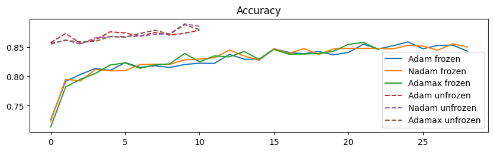
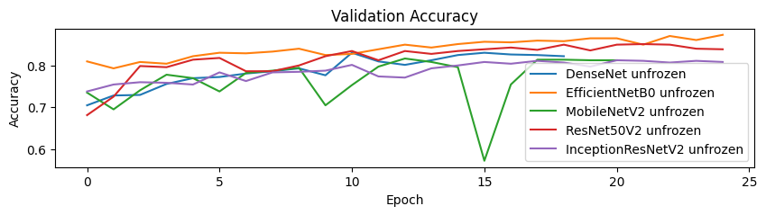
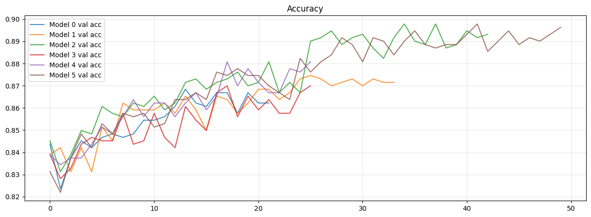
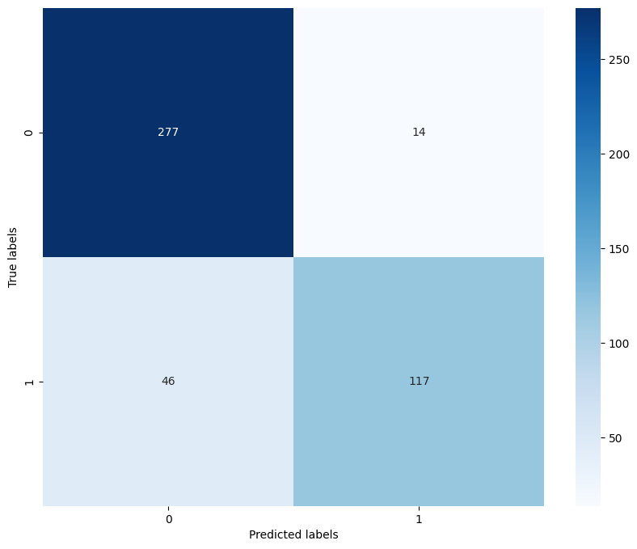
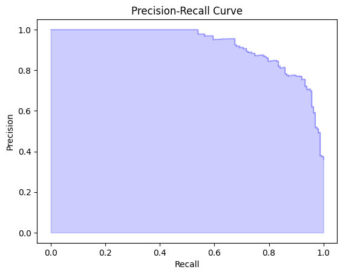

# Deep Learning Homework 1

* Course: `ARTIFICIAL NEURAL NETWORKS AND DEEP LEARNING`
* Professor: `Prof. Dr. Matteucci Matteo`, `Prof. Dr. Giacomo Boracchi`
* University: `Politecnico di Milano`

## Project Structure:
### 1. Cleaning Data
- Using FastDump clustering, we removed outliers and duplicate images.

### 2. Optimizer Choice
- We tested different optimizers such as Nadam, Adam, and Adamax.
- We found that `Nadam` gives us the best result for our dataset problem.



### 3. Model Choice
- VGG16 base model
- Tested transfer learning on ImageNet dataset
- Tested different architectures like MobileNetV2, ResNet50V2, DenseNet, InceptionResNetV2, EfficientNetB0 using `FirstModelChoice.ipynb`
- We found out that `EfficientNetB0` performs the best when compared to other models.
- Then we tested different EfficientNet architectures like: B0, B1, B2, and B3.
- We found out that the baseline `EfficientNetB0` architecture performs best for our dataset problem.



### 4. Dense Layers Structure Choice
- We tested different dense layer architectures.
- We found out that the best performing is:
    - GlobalAveragePooling2D
    - BatchNormalization
    - Dropout - 0.4
    - Dense(10) - relu, HeUniform
    - BatchNormalization
    - Dense - sigmoid (output)

### 5. Unfreezing Depth Choice
- We tested unfreezing different amounts of layers in the EfficientNetB0 architecture when performing transfer learning using ImageNet weights.
- We found out that when we unfroze 30 and 35 layers, we are receiving the best accuracy.



### Final Notebook.ipynb
- We trained our two final models with 30 and 35 layers.
- For each, we calculated model performance metrics: ROC/AUC, Precision-Recall, Confusion matrix.

<div style="text-align: center;">
    
    
    
</div>

## Running Notebook Using Colab
- Inside Google Drive, create a folder `Challenge_1`.
- Inside, put `new_dataset.npz`.
Ensure you have this folder structure:
```
Challenge_1\
    - new_dataset.npz
```

## Link to Dataset
 - You can access the project using Google Drive: [Link](https://drive.google.com/drive/folders/1CNveXOY2PUIzpJjzCQcC_F5RIW7ikklx)
 - Link to the cleaned dataset: [Link](https://drive.google.com/drive/folders/15_bMwDtZfO9kaM-OQ3XrlS5HXLSPLfnB)
